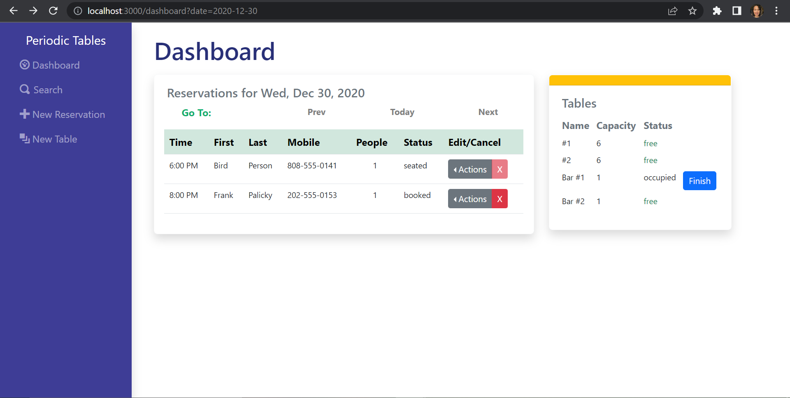

# Restaurant Reservations App

Reservation system for fine dining restaurants.
The software is used only by restaurant personnel when a customer calls to request a reservation.
At this point, the customers will not access the system online

## Links

* [App Demo](https://kf-restaurant-reservations.netlify.app/dashboard)

## Technology

### Built with:

* Node.js

  * Express server framework
  * Morgan and pino for logging
  * CORS for safer request headers
* PostgreSQL database

  * Knex.js for query building
* Testing on Jest framework and Supertest
* React
* Bootstrap

## Installation

* Fork and clone this repository.
* Run `cp ./back-end/.env.sample ./back-end/.env`.
* Update the `./back-end/.env` file with the connection URL's to your  database instances.
* Run `cp ./front-end/.env.sample ./front-end/.env`.
* You should not need to make changes to the `./front-end/.env` file unless you want to connect to a backend at a location other than `http://localhost:5001`.
* Run `npm install` to install project dependencies.
* Run `npm run start:dev` to start your server in development mode.

## API Documentation

All get requests return JSON response. All put requests require application/json body, and return JSON response.

The app consist of 4 routes:

| Route                               | Endpoints/Description                                                                                                                                                                                                                             |
| ----------------------------------- | ------------------------------------------------------------------------------------------------------------------------------------------------------------------------------------------------------------------------------------------------- |
| /reservations                       | Allows GET PUT POST for reservations                                                                                                                                                                                                              |
| /reservations/:reservationId/status | Allows PUT to update reservation status only                                                                                                                                                                                                      |
| /tables                             | Allows GET and POST for tables                                                                                                                                                                                                                    |
| /tables/:tableId/seat               | Allows PUT and DELETE to simultaneously update or remove a  reservation id from a table then update the reservation status<br />**A reservation will be seated if a table is assigned it's id and finished when the id is removed from the table |

### Endpoints for Reservations

The reservations route allows for GET, PUT, and POST endpoints.  Functionality is added to list all reservations, read a reservation by id, and create and update a reservation.

#### Get Reservations: `GET /api/reservations`

* Requests all reservation entries given a query of a date or mobile_number
  * ex: `/reservations?date=2020-12-31 will retrieve all reservations with a reservation date of 2020-12-31 and filter by reservations with status that is not "finished" or "cancelled"`
  * `/reservations?mobile_number=555-555-5555 will retrieve all reservations matching the mobile number.  It does not filter reservations by status`
* Successful get request will return an object of data with an array of reservation objects

```json


{
   "data":[
      {
         "reservation_id":3,
         "created_at":"2020-12-10T08:31:32.326Z",
         "updated_at":"2020-12-10T08:31:32.326Z",
         "first_name":"Bird",
         "last_name":"Person",
         "mobile_number":"808-555-0141",
         "reservation_date":"2020-12-30T05:00:00.000Z",
         "reservation_time":"18:00:00",
         "people":1,
         "status":"booked"
      },
    // ...
  ]
}


```

#### Get Reservation By Id: `GET /api/reservations/:reservationId`

* This route will return a single reservation by ID.
* Successful get request will return an object of data with an array of a single reservation object

```json


{
   "data":{
      "reservation_id":1,
      "created_at":"2020-12-10T08:30:32.326Z",
      "updated_at":"2020-12-10T08:30:32.326Z",
      "first_name":"Rick",
      "last_name":"Sanchez",
      "mobile_number":"202-555-0164",
      "reservation_date":"2020-12-31T05:00:00.000Z",
      "reservation_time":"20:00:00",
      "people":6,
      "status":"booked"
   }
}


```

##### Incorrect Reservation ID

If the given ID does not match an existing reservation, an unsuccessful get request will be made, and the following will be returned:

```json
{"error":"Reservation 99 does not exist"}
```

The response will have `404` as the status code.

#### POST Reservation: `POST /api/reservations/`

* This route will create a new reservation

A body like the following should be passed along with the request:

```json


  {
    "data": {
        "first_name": "first",
        "last_name": "last",
        "mobile_number": "800-555-1212",
        "reservation_date": "2025-01-01",
        "reservation_time": "17:30",
        "people": 2,
      }
  }


```

A successful request will respond with the new reservation record and default the status to booked

```json
{

  "data": {
	"reservation_id":1,
      	"created_at":"2020-12-10T08:30:32.326Z",
      	"updated_at":"2020-12-10T08:30:32.326Z",
        "first_name": "first",
        "last_name": "last",
        "mobile_number": "800-555-1212",
        "reservation_date": "2025-01-01",
        "reservation_time": "17:30",
        "people": 2,
	"status":"booked"
      }
}

```

#### POST Reservations Request restrictions

POST requests have the following restrictions for the body of the request:

1. The body must have only valid reservation properties
2. The body must include all reservation properties except for the status, id, created_at, and updated_at properties
3. The reservation date, time, and people properties must be valid date and times and people must be a number,
4. The date must not be a Tuesday (restaurant is closed)
5. The date and time must be a future date or time
6. The time must not be before 10:30 AM (open time)
7. The time must be 60 min before close (9:30 PM)

An unsuccessful request may be a result in an error with the message describing one of these restrictions.  The status code will be 400 if a request fails based off these restrictions.

#### PUT Reservation By Id: `PUT /api/reservations/:reservationId`

* This route will read the reservation by id then update the reservation with the data in the body of the request

A body like the following should be passed along with the request:

```json
  {
    "data": {
        "first_name": "first",
        "last_name": "last",
        "mobile_number": "800-555-1212",
        "reservation_date": "2025-01-01",
        "reservation_time": "17:30",
        "people": 2,
      }
  }
```

A successful request will respond with the reservation record with the newly patched content

```json
{

  "data": {
	"reservation_id":1,
      	"created_at":"2020-12-10T08:30:32.326Z",
      	"updated_at":"2020-12-10T08:30:32.326Z",
        "first_name": "first",
        "last_name": "last",
        "mobile_number": "800-555-1212",
        "reservation_date": "2025-01-01",
        "reservation_time": "17:30",
        "people": 2,
	"status":"booked"
      }
}
```

##### Incorrect ID PUT Requests

If the given ID does not match an existing reservation, a response like the following will be returned:

```json
{"error":"Reservation 99 does not exist"}
```

The response will have `404` as the status code response.

##### Request restrictions

PUT requests also have the following restrictions for the body of the request:

1. The body must have only valid reservation properties
2. The body must include all reservation properties except for the status, id, created_at, and updated_at properties
3. The reservation date, time, and people properties must be valid date and times and people must be a number,
4. The date must not be a Tuesday (restaurant is closed)
5. The date and time must be a future date or time
6. The time must not be before 10:30 AM (open time)
7. The time must be 60 min before close (9:30 PM)

An unsuccessfull request may be a result in an error with the message describing one of these restrictions.  The status code will be 400 if a request fails based off these restrictions. These restrictions are the same as the restrictions to create a reservation

#### PUT /api/reservations/:reservationId/status

* This route will read the reservation by id then update the reservation  status with the data in the body of the request

A body like the following should be passed along with the request:

```json
{
   "data":{
      "status":"seated"
   }
}
```

A successful request will respond with the reservation record with the newly patched status

```json
{

  "data": {
	"reservation_id":1,
      	"created_at":"2020-12-10T08:30:32.326Z",
      	"updated_at":"2020-12-10T08:30:32.326Z",
        "first_name": "first",
        "last_name": "last",
        "mobile_number": "800-555-1212",
        "reservation_date": "2025-01-01",
        "reservation_time": "17:30",
        "people": 2,
      }
}
```

##### Incorrect ID

If the given ID does not match an existing reservation, a response like the following will be returned:

```json
{"error":"Reservation 99 does not exist"}
```

The response will have `404` as the status code response.

##### Request restrictions

PUT requests  have the following restrictions for the body of the request:

1. The status must be one of "booked", "seated", "cancelled", or "finished"
2. The current status of a reservation must not be "finished"

An unsuccessful request may be a result in an error with the message describing one of these restrictions.  The status code will be 400 if a request fails based off these restrictions. These restrictions are the same as the restrictions to create a reservation

### Endpoints for Tables:

#### Get Tables: `GET /api/tables`

This route will return all the tables

The response from the server will look like the following.

```json
{
    "data": [
        {
            "table_id": 1,
            "table_name": "#1",
            "capacity": 6,
            "created_at": "2022-10-14T00:26:20.745Z",
            "updated_at": "2022-10-14T00:26:20.745Z",
            "reservation_id": null
        },
    // ...
  ]
}

```

#### POST Tables : `POST /api/tables`

* This route will create a new reservation

A body like the following should be passed along with the request:

```json
  {
    "data": {
        "table_name": "Bar #2",
        "capacity": 1,
      }
  }
```

A successful request will respond with the new table record and default the reservation_id to null

```json
{
   "data":{
      "table_id":4,
      "table_name":"Bar #2",
      "capacity":1,
      "created_at":"2022-10-14T00:26:20.745Z",
      "updated_at":"2022-10-14T00:26:20.745Z",
      "reservation_id":null
   }
}
```

##### POST Tables Request restrictions

POST requests for tables have the following restrictions for the body of the request:

1. The body must have only valid property names of a table.
2. The body must include the table name and the capacity
3. The table name must be at least 2 characters long
4. The capacity must be a number

An unsuccessful request may be a result in an error with the message describing one of these restrictions.  The status code will be 400 if a request fails based off these restrictions.

#### PUT /api/tables/:tableId/seat

* This route will read the table by id, read the reservation by the id given in the request body, and then update the table with the reservation id and change the status on the reservation to seated in a single transaction. A body like the following should be passed along with the request:

```json
{
   "data":{
      "reservation_id":"1"
   }
}
```

A successful request will respond with status 200.

##### Seating PUT Request restrictions

PUT requests  have the following restrictions:

1. The body must include a reservation_id
2. A reservation must exist with the given id
3. The reservation must not be already seated
4. The table must not already have a reservation_id assigned
5. The table capacity must be able to seat the people at the reservation

An unsuccessful request may be a result in an error with the message describing one of these restrictions.  The status code will be 400 if a request fails based off these restrictions. These restrictions are the same as the restrictions to create a reservation

#### DELETE /api/tables/:tableId/seat

* This route will read the table by id, find the reservation_id assigned in the table data, then update the reservation with status "finished", and remove the reservation id from the table to free it for the next reservation:

A successful request will respond with status 200.

##### DELETE Request restrictions

PUT requests  have the following restrictions:

1. The table must have a reservation id assigned to it

An unsuccessful request may be a result in an error with the message describing one of these restrictions.  The status code will be 400 if a request fails based off these restrictions. These restrictions are the same as the restrictions to create a reservation

## Client Documentation

The reservations system allows restaurants to track and input reservations as well as track and input tables.  Reservations may be seated at tables and the user can view which tables are open or occupied.

### Dashboard



The dashboard will be the home page and is split into two components: Reservations and Tables

#### Reservations on Dashboard

The reservations component on the dashboard displays the reservations for a selected date in table format.  By default, the date will be set to the current date.  The date may be changed by 3 date change buttons prev, today, and next.  Clicking this date will re-query the GET request sent to the API to reload the tables.

The reservations listed on the dashboard will be filtered by those that are with status of "booked" or "seated" only.

The final column of the reservations table will be an "actions" drop-down button and a cancel button for each reservation.  The actions available will be "seat" or "edit"

The seat button will redirect to the Seating Reservation Page where the reservation can be seated at a table when ready. (see below for more info). This button will only display if the reservation is not already seated

The edit button will redirect to the Edit Reservation Form.  This will be the same as the New Reservation form except the selected reservations information will be loaded onto the form and the reservation and a PUT request will be sent to the API instead of POST to update th reservation.


The cancel button will set the reservations status as "cancelled".

On click the window will ask to confirm the user wants to cancel the reservation.

On confirm, the reservation's status will be changed and the reservations reloaded for the selected date filtering out the reservations that are cancelled.  No action will be taken on cancel of the confirmation


#### Tables on Dashboard

The tables component on the dashboard will display all tables and display if the table is occupied or free.

Next to each occupied table will be a "finish" button that will ask to confirm if the user wants to mark the reservation as finished and free the table for the next reservation.  This action can not be undone.

On Confirm the Dashboard will be reloaded with the table free and the reservation at that table will be marked finished removing it from the reservations list on the dashboard. No actions will be taken on cancel.


### Seating a Reservation


Seating a reservation will assign the reservation to the table and mark the reservation's status as "seated"

On the page a form with a select options input will be displayed.

The user will need to select the table to seat the reservation at.

The options will be displayed as "table name - table capacity".

the reservations capacity must be kept in mind so that the user does not select a table that is too small for the reservation.  This will display an error on the page if so and no action taken.

On a successful submission,  The user will be taken back to the dashboard and the table will be updated with status occupied and the reservation will be updated with status "seated"

### Searching for Reservation


Reservations can be searched by mobile number using the search link on the navigation bar.

An input box to enter the mobile number will be displayed and on submit the same reservations listed on the dashboard will be loaded below.  However, these reservations will not be filtered by their status, so all finished and cancelled reservations will also display on this list.

The reservations will have the same action and cancel buttons.  However, the edit option from the drop-down of actions will be displayed for reservations that are cancelled.  This will also take the user to the Edit Reservation Form, but the option to change the reservation from cancelled to booked will be available in the case that they may have cancelled in error or customer changed their mind.

### New Reservation Form


A new reservation can be created by clicking the new reservation link on the navigation bar.

This will display a form to enter the reservation info including: First Name, Last Name, Mobile Number, Reservation Time, Reservation Date, and the number of people needing to be seated (which is defaulted to 1).

All fields will be required and any restrictions violated from the backend will be displayed at the top of the form.

On submit, the user will be taken back to the dashboard displaying reservation for the date of the newly created reservation so that it can be visible on the reservations table.

If the form is cancelled the user will be pushed back to their last visited page.

### New Table Form


New tables can be added by using the New Table link on the navigation.

A form will be display with inputs for the table name and capacity

All fields will be required and any restrictions violated on the backend will be displayed at the top of the form.  

User will need to be sure to enter the correct information as there is not yet a feature to edit or delete tables once created

On submit of the form, the user will be taken to the dashboard page with the current date's reservations loaded, and the new table will be visible on the tables section of the dashboard.  

On cancel, the user will be directed back to their previous location.
